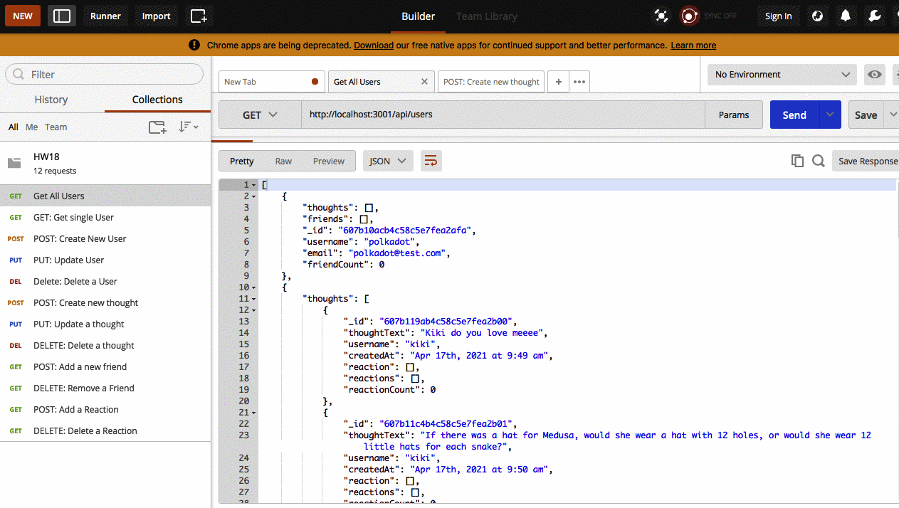

# thoughts-the-gathering

## Description

This is an API for a social network web application called Thoughts-The-Gathering where users can share their thoughts, reactions, and create friend lists. It uses mongoose - which is a NoSQL package.

## User Story

AS A social media startup I WANT an API for my social network that uses a NoSQL database SO THAT my website can handle large amounts of unstructured data

## Table of Contents

* [Technology Used](#technology-used)
* [Usage](#usage)
* [Models](#models)
* [License](#License)
* [Walk-through](#walk-through)

## Technology Used
- Mongoose (NoSQL)
- Express.js
- Node.js

## Usage

## Models
- User
- Thought
- Reaction

## License

This project is licensed MIT license.

## Walk-through

